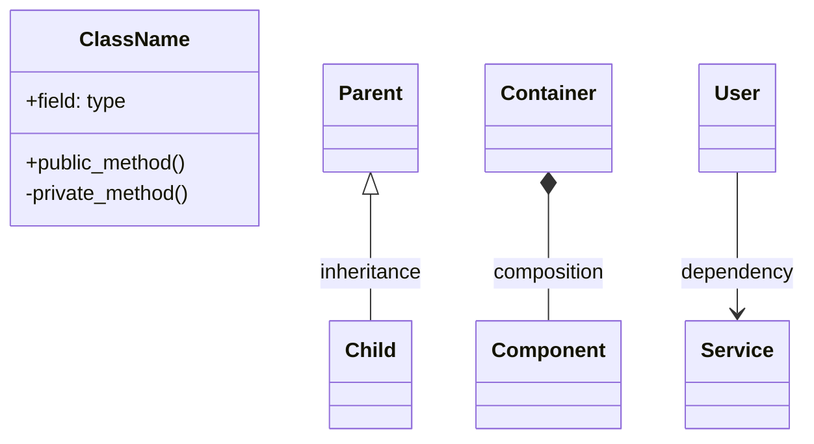

# Design Documentation

This directory contains architectural design documents and diagrams for the Twinkle Code Evaluator framework.

## 📋 Contents

### Architecture Diagrams

- **[system_architecture.mmd](./system_architecture.mmd)** - Overall system architecture showing the relationships between different layers
- **[class_diagram.mmd](./class_diagram.mmd)** - Detailed class relationships and component interactions

### Process Flow Diagrams

- **[eval_flowchart.mmd](./eval_flowchart.mmd)** - Evaluation process flowchart
- **[eval_process.mmd](./eval_process.mmd)** - Detailed evaluation workflow steps

## 🔍 How to View Diagrams

### GitHub (Recommended)
The `.mmd` files will render automatically when viewed on GitHub, providing interactive diagrams.

### Local Viewing Options

1. **Mermaid Live Editor**:
   - Go to https://mermaid.live/
   - Copy and paste the content from `.mmd` files
   - View and edit interactively

2. **VS Code Extension**:
   ```bash
   # Install Mermaid Preview extension
   code --install-extension bierner.markdown-mermaid
   ```

3. **Command Line Tool**:
   ```bash
   # Install mermaid CLI
   npm install -g @mermaid-js/mermaid-cli
   
   # Generate PNG/SVG
   mmdc -i system_architecture.mmd -o system_architecture.png
   mmdc -i class_diagram.mmd -o class_diagram.svg
   ```

## 📊 Diagram Overview

### System Architecture
- **Purpose**: High-level system overview
- **Scope**: All major components and their interactions
- **Audience**: New developers, system architects
- **Key Areas**: User interface, engine layer, backend layer, benchmark layer, execution layer, data layer

### Class Diagram  
- **Purpose**: Detailed class relationships and methods
- **Scope**: Core classes and their interfaces
- **Audience**: Developers working on specific components
- **Key Areas**: Registry system, backend implementations, benchmark implementations, utility classes

### Process Flow Diagrams
- **Purpose**: Step-by-step evaluation workflow visualization
- **Scope**: From configuration loading to result generation
- **Audience**: New developers, workflow understanding
- **Key Areas**: Initialization, prompt generation, model inference, evaluation, result aggregation

## 🔄 Updating Diagrams

When making architectural changes:

1. **Update the relevant `.mmd` file**
2. **Test rendering** on GitHub or Mermaid Live Editor
3. **Update this README** if adding new diagrams
4. **Consider updating related documentation** in parent `docs/` directory

## 📝 Mermaid Syntax Notes

### Supported Features
- Class diagrams with relationships
- Flowcharts and system diagrams
- GitHub-compatible syntax

### Common Patterns


## 🔗 Related Documentation

- **[Configuration Guide](../configuration_guide.md)** - YAML configuration reference
- **[CLAUDE.md](../CLAUDE.md)** - Comprehensive project documentation
- **[README.md](../../README.md)** - Project overview and quick start

## 📚 External References

- [Mermaid Documentation](https://mermaid-js.github.io/mermaid/)
- [GitHub Mermaid Support](https://github.blog/2022-02-14-include-diagrams-markdown-files-mermaid/)
- [UML Relationship Types](https://www.uml-diagrams.org/association.html)